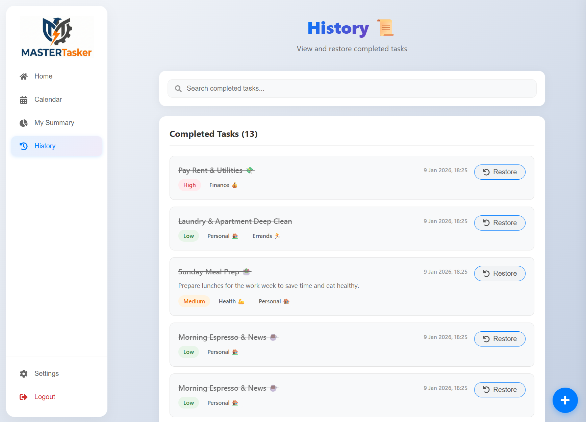

# MasterTasker


## About

A simple and intuitive calendar and task management app built to help users stay organized without overcomplicating their workflow.  
This project focuses on clean design, practical features, and a smooth user experience for everyday planning.

## Key Features

*   **📅 Unified Calendar & Tasks:** Seamlessly switch between list views and monthly/weekly calendar views.
*   **🔁 Smart Recurrence Engine:** Complex recurring logic (Daily, Weekly, Monthly, Yearly) handled natively in the backend.
*   **✋ Drag & Drop Interface:** Powered by `@hello-pangea/dnd` for intuitive task reordering and calendar scheduling.
*   **📊 Productivity Analytics:** Visual insights using `Recharts` to track completion rates, priority distribution, and activity logs.
*   **⚡ Optimistic UI:** Instant feedback on user actions (like checking off a task) before the server responds.
*   **🔍 Advanced Filtering:** Filter by multiple tags, priority levels, date ranges, and status simultaneously.
*   **🔐 Secure Authentication:** JWT-based stateless authentication with Bcrypt password hashing.
*   **🐳 Dockerized:** Fully containerized environment for easy deployment and development.

### Calendar Page


## Tech Stack

### **Frontend (Client)**
*   **Framework:** React 19 (via Vite)
*   **Routing:** React Router DOM v7
*   **State Management:** React Context API + Custom Hooks (`useTasks`)
*   **Styling:** CSS Modules with Glassmorphism Design System
*   **Calendar:** `react-big-calendar` + `date-fns`
*   **Drag & Drop:** `@hello-pangea/dnd`
*   **Charts:** `recharts`
*   **HTTP Client:** `axios`

### **Backend (Server)**
*   **Runtime:** Node.js
*   **Framework:** Express.js
*   **Database:** MongoDB (Mongoose ODM)
*   **Validation:** Joi
*   **Security:** Helmet, XSS-Clean, Mongo-Sanitize, CORS
*   **Auth:** JSON Web Tokens (JWT)

### **DevOps**
*   **Containerization:** Docker & Docker Compose
*   **Hot Reloading:** Vite (Client) + Nodemon (Server) inside Docker

## Getting Started (Docker)

The easiest way to run MasterTasker is using Docker Compose.

### Prerequisites
*   Docker Desktop installed and running.

### Installation Steps

1.  **Clone the repository**
    ```bash
    git clone https://github.com/your-username/MasterTasker.git
    cd MasterTasker
    ```

2.  **Configure Environment Variables**
    Create a `.env` file in the `server/` directory (or rely on the defaults in `docker-compose.yml` for dev):
    ```bash
    # server/.env
    PORT=5000
    MONGO_URI=mongodb://mongo:27017/mastertasker
    JWT_SECRET=your_super_secret_key_123
    NODE_ENV=development
    ```

3.  **Run with Docker Compose**
    ```bash
    docker-compose up --build
    ```

4.  **Access the Application**
    *   **Frontend:** http://localhost:5173
    *   **Backend API:** http://localhost:5000
    *   **MongoDB:** `mongodb://localhost:27017`

5.  **Seed Data (Optional)**
    To populate the DB with realistic demo data (User: `mike@mastertasker.com` / Pass: `mike123`):
    ```bash
    docker-compose exec server npm run seed
    ```

## Screenshots

### Home Page:


### Calendar Page:


### Summary Page:


### History Page:


### Add/Edit Task:


### Login/Carte Account: 


## Project Structure

```bash
MasterTasker/
├── client/                 # React Frontend
│   ├── src/
│   │   ├── components/     # Reusable UI (Buttons, Cards, Modals)
│   │   ├── context/        # Global State (TaskContext)
│   │   ├── features/       # Feature-based modules (Auth, Dashboard, Tasks)
│   │   ├── hooks/          # Custom Hooks (useTasks)
│   │   ├── pages/          # Route Views (Dashboard, Work, Analytics)
│   │   └── services/       # API Service Layer
│   └── Dockerfile
│
├── server/                 # Node.js Backend
│   ├── src/
│   │   ├── config/         # DB Connection
│   │   ├── controllers/    # Request Logic
│   │   ├── middleware/     # Auth & Error Handling
│   │   ├── models/         # Mongoose Schemas (Task, User)
│   │   ├── routes/         # API Routes
│   │   ├── services/       # Business Logic
│   │   └── utils/          # Helpers (Seeder, Urgency Calc)
│   └── Dockerfile
│
└── docker-compose.yml      # Orchestration
```

## Environment Variables

| Variable | Description | Default (Dev) | Location |
| :--- | :--- | :--- | :--- |
| `PORT` | Backend server port | `5000` | `server/.env` |
| `MONGO_URI` | MongoDB connection string | `mongodb://mongo:27017/...` | `server/.env` |
| `JWT_SECRET` | Secret key for signing tokens | `mysecretkey123456` | `server/.env` |
| `NODE_ENV` | Environment mode | `development` | `server/.env` |
| `VITE_API_URL` | Backend URL for Frontend | `http://localhost:5000/api` | `client/.env` |

## License

This project is licensed under the MIT License.
