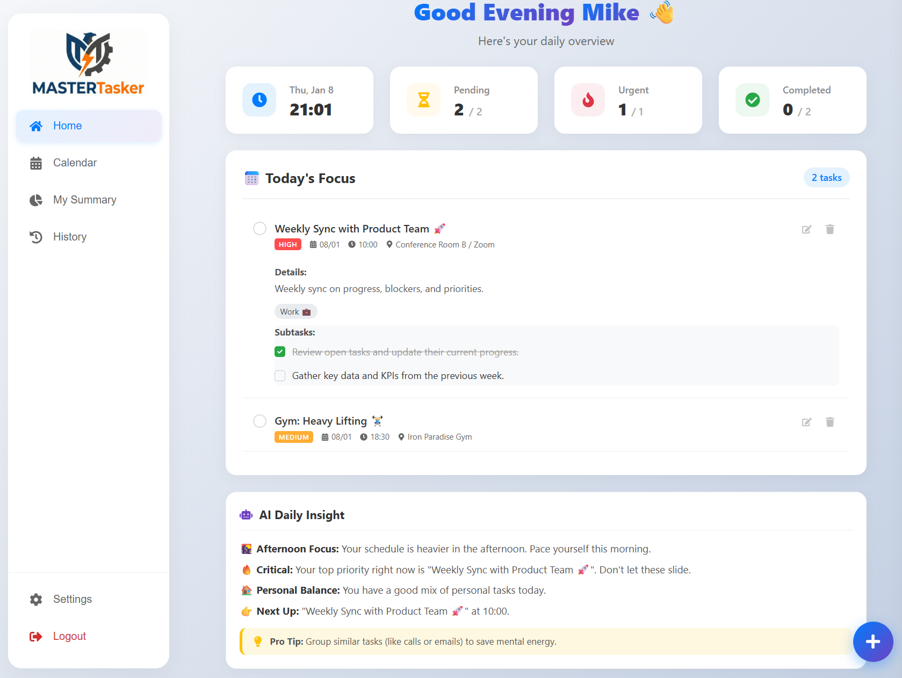

# MasterTasker


## About

MasterTasker is a calendar-based task management app built to make everyday planning simpler and more intuitive.
The goal of this project was to create something practical and pleasant to use, without overwhelming the user with unnecessary complexity.

## Key Features

* **Calendar & Task Views**
  Switch easily between list views and weekly/monthly calendar views.
* **Recurring Tasks**
  Support for daily, weekly, monthly, and yearly recurring tasks handled on the backend.
* **Drag & Drop**
  Intuitive task reordering and calendar scheduling using drag and drop.
* **Productivity Insights**
  Simple charts that help visualize task completion and priorities.
* **Optimistic UI**
  Instant feedback for user actions, making the app feel fast and responsive.
* **Authentication**
  Secure JWT-based authentication with hashed passwords.
* **Docker Ready**
  Fully containerized for easy setup and consistent development environments.

## Screenshots

### Calendar View:


### Home Page:


### Summary:


### Add/Edit Task:


## Getting Started (Docker)

The easiest way to run MasterTasker is using Docker Compose.

### Prerequisites
*   Docker Desktop installed and running.

## Getting Started (Docker)

The easiest way to run the project locally is using Docker.

### Prerequisites

* Docker Desktop

### Run the Project

```bash
git clone https://github.com/your-username/MasterTasker.git
cd MasterTasker
docker-compose up --build
```

Once running:

* Frontend → [http://localhost:5173](http://localhost:5173)
* Backend API → [http://localhost:5000](http://localhost:5000)

### Optional: Seed Demo Data

```bash
docker-compose exec server npm run seed
```

Demo user:
**Email:** `mike@mastertasker.com`
**Password:** `mike123`

## Why this project?

I wanted to build a real-world application that goes beyond a basic CRUD app — something that involves state management, scheduling logic, authentication, and a meaningful user experience.

MasterTasker helped me practice:

* Designing a full-stack architecture
* Handling complex recurring task logic
* Building a responsive, interactive UI
* Working with Docker in a real development setup

## Future Improvements

* Notifications and reminders
* Recurring task exceptions
* Improved mobile experience
* Better analytics and insights

## License

MIT License
